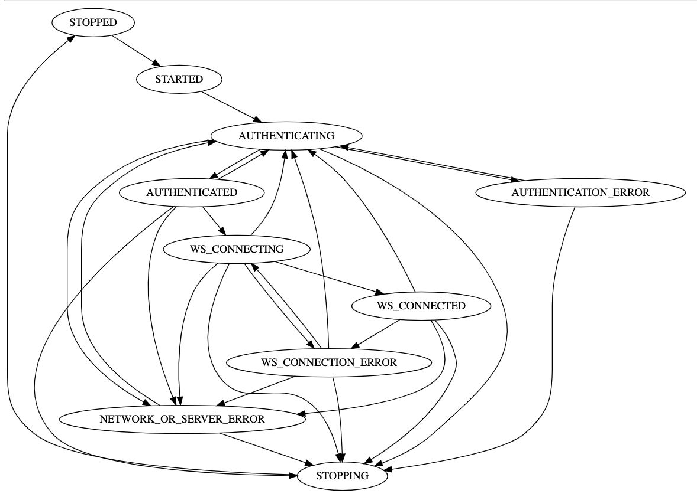

# @taktik/ozone-client

TypeScript client for the Ozone v3 API: it manages the connection — authentication, session,
WebSocket — and exposes a typed sub-client per resource.

## Install

```
yarn add @taktik/ozone-client
```

The `@taktik` scope is served by the Taktik registry, so it has to be routed — in your `.npmrc`:

```
@taktik:registry=https://npm.taktik.be/repository/npm/
```

## Getting a client

```typescript
import { OzoneClient } from '@taktik/ozone-client'
import UserCredentials = OzoneClient.UserCredentials
import ClientConfiguration = OzoneClient.ClientConfiguration
import newOzoneClient = OzoneClient.newOzoneClient

const config: ClientConfiguration = {
	ozoneURL: 'https://my.ozone.domain/ozone',
	ozoneCredentials: new UserCredentials('ozoneUser', 'ozonePassword')
}

const client = newOzoneClient(config)
await client.start()      // authenticates, then opens the WebSocket
```

Other credentials are available for the other ways in: `SessionCredentials` (an existing browser
session), `TokenCredentials`, `ItemCredentials`, `ItemByQueryCredentials`, `OzoneLoginCredentials`.

Call `start()` once. From there the client keeps itself alive — it re-authenticates and reconnects
on its own, with an exponential back-off.

## The sub-clients

```typescript
client.itemClient<Video>('video')   // items of one Ozone type
client.blobClient()                 // binary upload and download
client.taskClient()                 // submit a task, wait for its result
client.typeClient()                 // type descriptors, with a cache
client.fileTypeClient()             // file types, with a cache
client.roleClient()
client.permissionClient()
client.tenantClient()
client.importExportClient()
```

For instance, reading an item and saving it back:

```typescript
import { Video, toPatch } from '@taktik/ozone-type'

const videoClient = client.itemClient<Video>('video')

const video = await videoClient.findOne('uuid-yyy-zzz')
if (!video) return

const patch = toPatch(video)
patch.name = 'a new name'
await videoClient.save(patch)
```

Anything the sub-clients do not cover goes through the low-level call, which carries the session and
the filters like the rest:

```typescript
import { Request } from 'typescript-http-client'

const result = await client.call<MyResult>(new Request(url).setMethod('POST').setBody(body))
```

## Following the connection

The client is a state machine, and you can hook onto any of its states:



```typescript
import { OzoneClient } from '@taktik/ozone-client'
import ClientStates = OzoneClient.states

client.onEnterState(ClientStates.AUTHENTICATED, () => { /* logged in */ })
client.onEnterState(ClientStates.STOPPED, () => { /* logged out */ })

client.onEnterState(ClientStates.AUTHENTICATION_ERROR, () => {
	const failure = client.lastFailedLogin      // the Response, so you can read its status
})
```

`client.authInfo` is set as soon as a session exists, which is how you tell an already-logged client
from a fresh one without waiting for a transition.

To switch user without rebuilding anything, `client.updateCredentials(credentials)` — the client
logs in again by itself.

## Receiving messages

Once the WebSocket is up, Ozone pushes device messages:

```typescript
const registration = client.onMessage<DeviceMessageAlert>('alert', message => { /* ... */ })
registration.cancel()

client.onAnyMessage(message => { /* ... */ })
client.send(message)
```

## HTTP filters

Every call goes through `preFilters` then the client's own filters then `postFilters`. Both arrays
are live — push to them at any time to add a header, log, or intercept a status.
